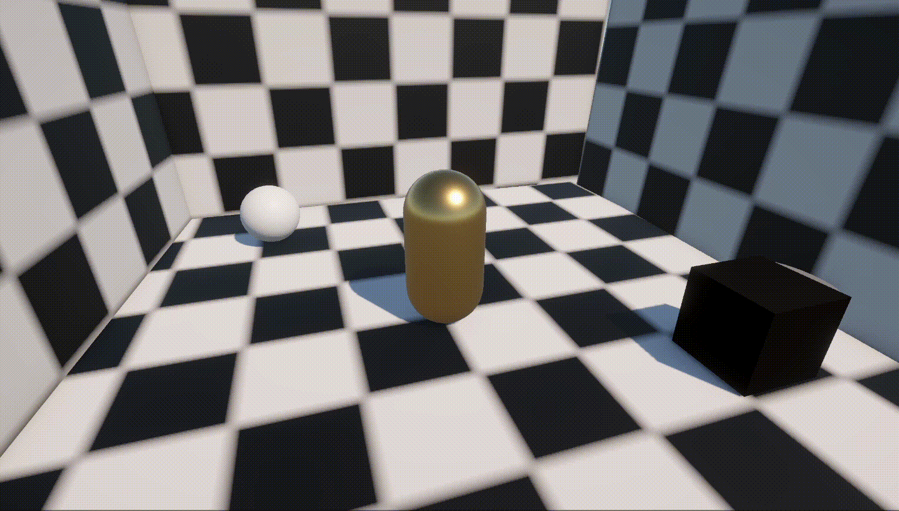
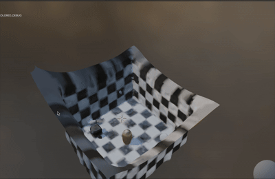

# Blurred LiDAR for Sharper 3D

---

## 🖥️ Command line prompt

```bash
python train.py -s MyUnityScene --hist_far 20 --num_hist_bins 128 --transi_only_until 100 --max_gaussians 2000000 --transi_weight 0.01 --cull_over 15 --cull_over_transi_only 5 --cull_every 5 --loss_curv_w 0.05
```

## Mesh comparison

Mesh comparison
<p align="center">  &nbsp;&nbsp;&nbsp;  </p> 


